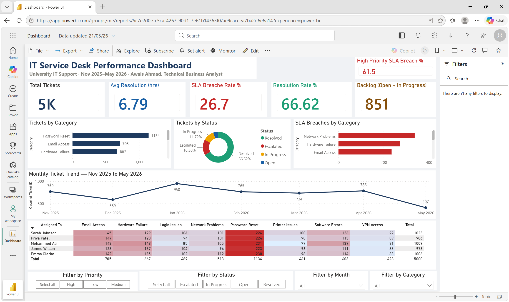

# 🖥️ IT Service Desk Analytics & Optimisation
### Power BI Dashboard | Business Analyst Portfolio Project

> **Awais Ahmad** · Technical Business Analyst · May 2026  
> 📊 [Live Dashboard](https://app.powerbi.com/groups/me/reports/5c7e2d0e-c5ca-4267-90d1-7e61b14363f0) · 💼 [LinkedIn](https://linkedin.com/in/awais-techba) · 🐙 [GitHub](https://github.com/awais-techba)

---

## 📌 Project Overview

End-to-end Business Analyst portfolio project analysing **5,000 IT support tickets** from a fictional university IT Service Desk (November 2025 – May 2026).

The goal was to identify operational inefficiencies, quantify business impact in £, and deliver a complete BA documentation set — from Problem Statement through to a live interactive Power BI dashboard.

> ⚠️ *Disclaimer: This project uses synthetic data for portfolio demonstration purposes only. No real organisation or individuals are represented.*

---

## 🔗 Live Dashboard

[](https://app.powerbi.com/groups/me/reports/5c7e2d0e-c5ca-4267-90d1-7e61b14363f0)

**Dashboard URL:**  
`https://app.powerbi.com/groups/me/reports/5c7e2d0e-c5ca-4267-90d1-7e61b14363f0`

---

## 📊 Dashboard Preview



---

## 🔑 Key Performance Indicators

| Metric | Value | Target | Status |
|--------|-------|--------|--------|
| Total Tickets | 5,000 | — | ✅ |
| Resolution Rate | 66.62% | 95% | 🔴 Below target |
| Avg Resolution Time | 6.79 hrs | 4.0 hrs | 🔴 Below target |
| SLA Breach Rate | 26.7% | < 5% | 🔴 Below target |
| Backlog (Open + In Progress) | 851 | < 5% | 🟡 Needs attention |
| High Priority Breach Rate | 61.5% | < 5% | 🔴 Critical |

---

## 💡 Key Findings

### Finding 1 — Password Resets Dominate Workload 🔴

| Metric | Detail |
|--------|--------|
| Volume | 1,134 tickets — **23% of all tickets** (highest category) |
| Avg Resolution | 0.5 hrs (30 minutes) per ticket |
| Monthly Volume | ~162 tickets/month |
| Annual Analyst Cost | 162 × 0.5 hrs × £25/hr × 12 = **£24,300/year** |
| **Solution** | **Microsoft SSPR — FREE with existing Office 365 licence** |
| **Annual Saving** | **£24,300 — zero implementation cost** |

> 💬 *"Every minute an analyst spends resetting a password is a minute not spent fixing a network outage or improving the service. Microsoft SSPR eliminates this category entirely at zero cost."*

---

### Finding 2 — Network Problems Create SLA Bottleneck 🔴

| Metric | Detail |
|--------|--------|
| Volume | 513 tickets (10% of total) |
| Avg Resolution | **19.9 hrs — 5× over the 4hr High Priority SLA target** |
| Root Cause | No fast-track escalation path — unmanaged vendor wait times |
| Impact | Highest SLA breach category — major user productivity loss |
| **Recommendation** | Dedicated network specialist + pre-approved escalation path |

---

### Finding 3 — January Seasonal Surge — Unprepared 🟡

| Month | Tickets | vs Average |
|-------|---------|------------|
| November 2025 | 769 | +8% |
| December 2025 | 589 | -17% |
| **January 2026** | **950** | **+33% — PEAK** |
| February 2026 | 765 | +7% |
| March 2026 | 734 | ±0% |
| April 2026 | 786 | +10% |
| May 2026 | 407 | -43% |

> 💬 *"A 133% variance between January and May is predictable — university term start creates a seasonal surge every year. A staffing plan costs nothing to create and prevents a lot of SLA breaches."*

---

## 🎯 Recommendations

| Priority | Recommendation | Effort | Impact | Saving |
|----------|---------------|--------|--------|--------|
| 1 — HIGH | Self-service Password Reset (MS SSPR) | Low | High | £24,300/yr |
| 2 — HIGH | Network fast-track escalation path | Low | High | SLA +40% |
| 3 — HIGH | SLA breach alerting in Power BI | Low | High | Compliance |
| 4 — MED | Weekly Friday backlog triage sessions | Low | Medium | Backlog -60% |
| 5 — MED | Seasonal staffing plan (Jan & Sep) | Low | Medium | Capacity |

---

## 📈 Projected Impact (12 Months)

| Metric | Current | Target | Improvement |
|--------|---------|--------|-------------|
| Monthly Ticket Volume | 714/month avg | 535/month | -25% |
| Avg Resolution Time | 6.79 hrs | 4.0 hrs | -41% |
| SLA Compliance | 73.3% | 95%+ | +22 pts |
| Backlog Rate | 17% | < 5% | -12 pts |
| **Annual Savings** | — | **£24,300+** | **ROI: ∞ (free tool)** |

---

## 🛠️ Tools & Technologies

| Tool | Usage |
|------|-------|
| **Power BI Desktop** | Dashboard development, interactive visualisations, published to Power BI Service |
| **DAX** | 6 custom measures: Resolution Rate %, SLA Breach Rate %, Backlog Count, High Priority Breach %, Est. Annual Savings GBP |
| **Microsoft Excel** | Data source — 5,000 row synthetic dataset, 11 columns |
| **Power Automate** | Scheduled refresh automation (planned Phase 3) |
| **Claude AI** | DAX formula assistance, data generation, documentation |

### DAX Measures Built

```dax
-- Resolution Rate
Resolution Rate % =
COUNTROWS(FILTER('IT Support Tickets', 'IT Support Tickets'[Status] = "Resolved"))
/ COUNTROWS('IT Support Tickets')

-- SLA Breach Rate
SLA Breach Rate % =
COUNTROWS(FILTER('IT Support Tickets', 'IT Support Tickets'[SLA Breach] = "Yes"))
/ COUNTROWS('IT Support Tickets')

-- Backlog Count
Backlog Count =
CALCULATE(
    COUNTROWS('IT Support Tickets'),
    'IT Support Tickets'[Status] IN {"Open", "In Progress"}
)

-- Estimated Annual Savings
Est Annual Savings GBP =
CALCULATE(
    COUNTROWS('IT Support Tickets'),
    'IT Support Tickets'[Category] = "Password Reset"
) * 0.5 * 25 * 12
```

---

## 📁 Repository Structure

```
it-service-desk-analytics/
│
├── 📸 dashboard_screenshot.png        ← Dashboard preview
├── 📊 IT_Support_Tickets_5000.xlsx    ← Raw dataset (5,000 tickets, 11 columns)
├── 💾 IT_Service_Desk_Dashboard.pbix  ← Power BI Desktop file
│
├── 📄 01_README.md                    ← This file
├── 📄 02_Executive_Summary.docx       ← Stakeholder presentation
├── 📄 03_Business_Requirements.docx   ← 16 functional requirements
├── 📄 04_User_Stories.docx            ← 12 user stories, 4 epics, 33 story points
│
└── 📄 Problem_Statement.docx          ← Problem definition & impact analysis
```

---

## 📋 BA Documentation Delivered

### ✅ Problem Statement
- Defined operational problem, stakeholder map, impact analysis, and desired future state
- Identified £24,300/year cost saving opportunity
- Established success criteria and KPI targets

### ✅ Business Requirements Document (BRD)
- 16 functional requirements across 3 categories (KPI Cards, Visualisations, Filtering)
- 5 non-functional requirements
- Full data requirements specification
- Scope definition (In Scope / Out of Scope)

### ✅ Agile User Stories
- 12 user stories across 4 epics
- 33 total story points
- Acceptance criteria for each story
- All stories: Status = Done ✅

### ✅ Executive Summary
- Performance snapshot with current vs target metrics
- 3 key findings with quantified business impact
- Prioritised recommendations with effort/impact/saving
- 12-month projected impact with ROI calculation
- Phased implementation roadmap (3 phases)

---

## 👤 About the Author

**Awais Ahmad**  
Technical Business Analyst | 10 Years Experience  
University of Greater Manchester (Current) | Anglia Ruskin University | Pakistan Air Force

- 🎓 MSc International Business & Data Analytics — Ulster University
- 🎓 MSc Computer Science — University of Lahore
- 📜 Scrum Master Certified (SMC) — The Knowledge Academy, Mar 2026
- 📜 Excel Power Tools for Data Analytics — Macquarie University

**Connect:**  
📧 mhd.awais.ahmad@gmail.com  
💼 [linkedin.com/in/awais-techba](https://linkedin.com/in/awais-techba)  
🐙 [github.com/awais-techba](https://github.com/awais-techba)

---

*⚠️ This project uses entirely synthetic data generated for portfolio demonstration purposes. No real university, organisation, or individuals are represented.*
